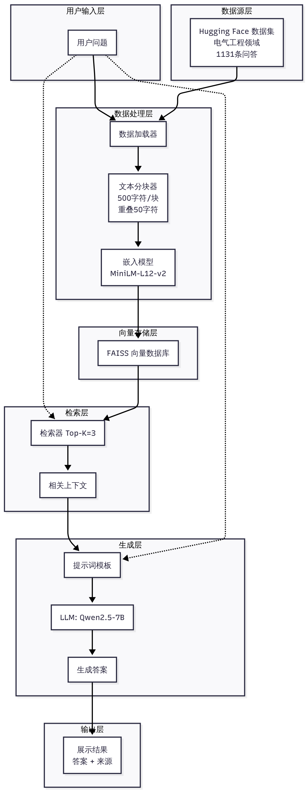

<div align="center">

# RAG Agent

**电气工程设备问答智能体**

[](https://www.python.org/downloads/)
[](https://github.com/astral-sh/uv)
[](https://www.langchain.com/)

基于 LangChain 和 Hugging Face 构建的 RAG 系统，专注于电气工程和工业设备领域的智能问答

</div>

---

## ✨ 核心功能

- 📚 **智能问答**：基于电气工程知识库的精准问答
- 📝 **自动报告生成**：一键生成结构化技术报告
- 🔄 **LangGraph 工作流**：模块化可扩展的智能体架构
- 🎯 **多种交互模式**：支持传统问答和 Graph 驱动的问答/报告

## 系统架构

### 整体架构

<div align="center">
  
</div>

### 模块化设计（LangGraph）

```
rag_agent/
├── __init__.py          # 主入口
├── cli.py               # CLI 交互层
├── config.py            # 配置管理
├── data_loader.py       # 数据集加载
├── rag_engine.py        # RAG 核心能力（检索 + 生成）
├── report_agent.py      # 报告生成能力
└── graph/               # LangGraph 工作流编排
    ├── base_state.py    # 状态定义
    ├── qa_graph.py      # 问答工作流
    └── report_graph.py  # 报告生成工作流
```

**设计理念**：
- **能力层**（RAGEngine、ReportAgent）：提供检索、生成等原子能力
- **编排层**（Graph）：定义工作流程、状态管理和节点转移
- **接口层**（CLI）：统一调用入口，支持多种交互模式

## 快速开始

### 1. 安装依赖

```bash
uv sync
```

### 2. 配置 API

复制示例配置并编辑 `.env` 文件：

```bash
cp .env.example .env
```

编辑 `.env`：

```env
OPENAI_API_KEY=sk-xxx                              # Silicon Flow API 密钥
OPENAI_API_BASE=https://api.siliconflow.cn/v1     # API 端点
MODEL_NAME=Qwen/Qwen2.5-7B-Instruct                # LLM 模型
DATASET_NAME=STEM-AI-mtl/Electrical-engineering   # 数据集
```

### 3. 构建向量数据库（首次运行）

**重要**：首次使用需要预先构建向量数据库（全量加载数据集）

```bash
# 构建向量数据库（全量数据，首次运行需要几分钟）
uv run rag-agent build

# 强制重新构建（覆盖已有数据库）
uv run rag-agent build --force
```

这将：
- 📥 加载完整数据集（不是采样）
- ⚙️ 分割文档并生成向量嵌入
- 💾 保存到 `.vectorstore/` 目录（持久化存储）

### 4. 启动应用

向量数据库构建完成后，后续启动**秒级加载**：

```bash
# 启动交互式问答界面
uv run rag-agent
```

### 工作流程说明

```
首次使用:
  1. uv run rag-agent build    → 构建向量库（3-5 分钟，全量数据）
  2. uv run rag-agent          → 启动应用（3-5 秒，直接加载）

后续使用:
  uv run rag-agent             → 直接启动（无需重建）
```

**为什么要预构建？**
- ✅ 避免每次启动时重新处理数据集
- ✅ 全量数据提供更好的检索效果（不是采样）
- ✅ 后续启动速度快（秒级）
- ✅ 向量库可复用、可分享

## 💡 使用方式

### 1. 普通问答模式

直接输入问题：

```
❓ 问题 ❯ 变压器短路试验的目的是什么？
```

系统会检索相关文档并生成答案。

### 2. 报告生成模式（传统）

使用 `/report` 命令：

```
❓ 问题 ❯ /report
🔎 报告主题 ❯ 高压断路器的日常维护
```

生成结构化的 Markdown 技术报告。

### 3. LangGraph 问答模式

使用 `/gqa` 命令（基于 LangGraph 工作流）：

```
❓ 问题 ❯ /gqa 电机绝缘测试的标准流程是什么？
```

经过 `准备输入 → 检索 → 生成答案` 的图节点流程。

### 4. LangGraph 报告模式

使用 `/grep` 命令（基于 LangGraph 工作流）：

```
❓ 问题 ❯ /grep 变压器油化验检测项目
```

经过 `准备输入 → 检索 → 生成报告` 的图节点流程。

### 退出程序

输入 `exit`、`quit`、`q` 或按 `Ctrl+C` 两次。

## 🛠️ 技术栈

| 组件 | 技术 | 用途 |
|------|------|------|
| **数据源** | Hugging Face Datasets | 电气工程问答数据集（1131条） |
| **嵌入模型** | Sentence Transformers | paraphrase-multilingual-MiniLM-L12-v2 |
| **向量数据库** | FAISS | Facebook AI 相似度搜索 |
| **LLM** | Qwen2.5-7B-Instruct | 通过 Silicon Flow API 调用 |
| **框架** | LangChain 1.1.0 | RAG 编排与链式调用 |
| **CLI** | prompt_toolkit + Rich | 交互式命令行界面 |
| **包管理** | uv | 快速依赖管理 |
| **代码质量** | Ruff + Pyright | 代码检查与类型检查 |

## 🔧 开发指南

### 项目结构

```
rag-agent/
├── rag_agent/              # 主包
│   ├── __init__.py         # 入口点
│   ├── cli.py              # CLI 交互
│   ├── config.py           # 配置
│   ├── data_loader.py      # 数据加载
│   ├── rag_engine.py       # RAG 核心能力
│   ├── report_agent.py     # 报告生成
│   └── graph/              # LangGraph 工作流
│       ├── base_state.py   # 状态定义
│       ├── qa_graph.py     # QA 图
│       └── report_graph.py # 报告图
├── pyproject.toml          # 项目配置
├── .env.example            # 环境变量模板
└── README.md               # 文档

```

### 扩展新智能体

基于 LangGraph 架构，添加新智能体非常简单：

1. **定义能力函数**：在 `rag_agent/` 下新建 Agent 类
2. **创建工作流图**：在 `graph/` 下定义节点和转移逻辑
3. **CLI 集成**：在 `cli.py` 中添加新命令

示例：添加"设备诊断智能体"

```python
# rag_agent/diagnose_agent.py
class DiagnoseAgent:
    def diagnose_from_docs(self, symptoms: str, documents):
        # 基于症状和检索文档进行诊断
        pass

# rag_agent/graph/diagnose_graph.py
def build_diagnose_graph(rag_engine, diagnose_agent):
    # 定义诊断工作流
    pass
```

### 代码质量检查

```bash
# 格式化代码
uv run ruff format .

# 检查代码质量
uv run ruff check .

# 类型检查
uv run pyright
```

## ⚙️ 配置选项

### 数据集选择

```env
# 电气工程（默认）
DATASET_NAME=STEM-AI-mtl/Electrical-engineering

# 其他英文数据集
DATASET_NAME=squad                    # 斯坦福问答
DATASET_NAME=natural_questions        # Google 自然问题

# 中文数据集
DATASET_NAME=cmrc2018                 # 中文阅读理解
```

## 📋 TODO

- [ ] 评估当前检索效果，建立基准线
- [ ] 尝试更好的中文 Embedding 模型（bge-large-zh、m3e-large）
- [ ] 实现混合检索（BM25 + 向量）
- [ ] 添加 Reranker 重排序
- [ ] 扩充高质量数据集
